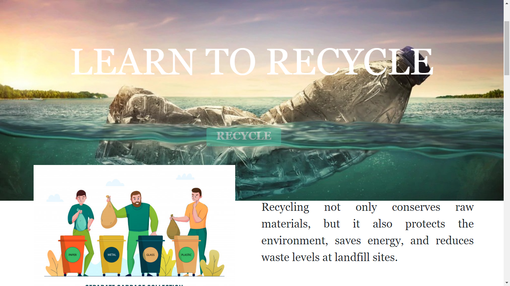
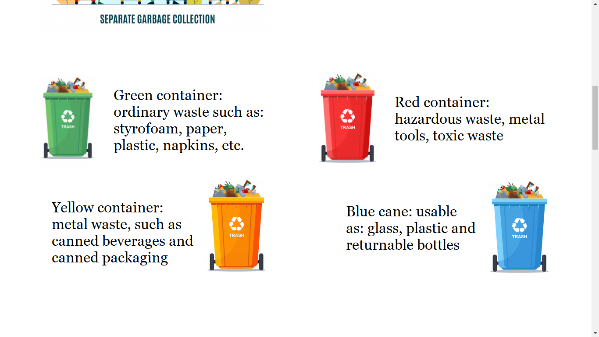
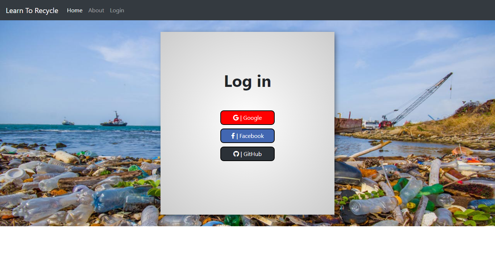
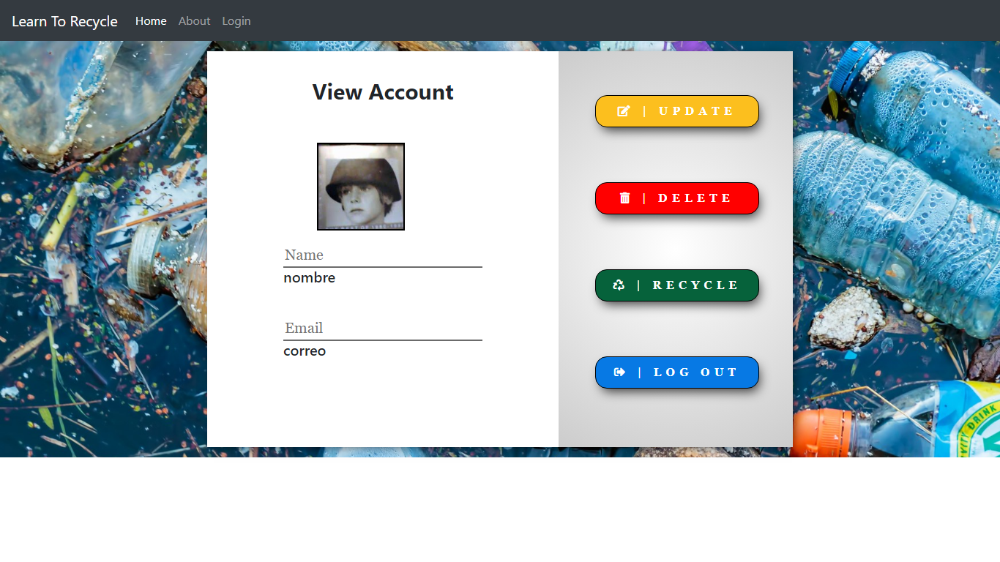
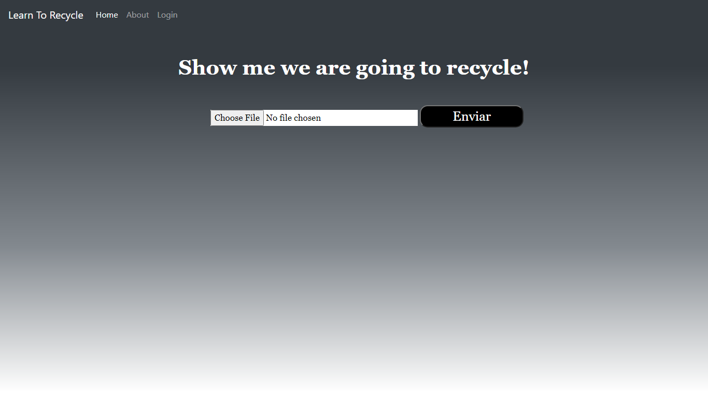
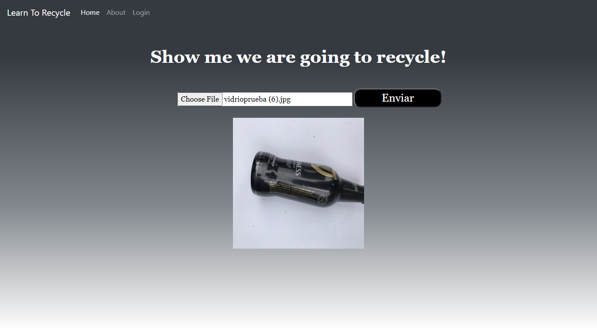
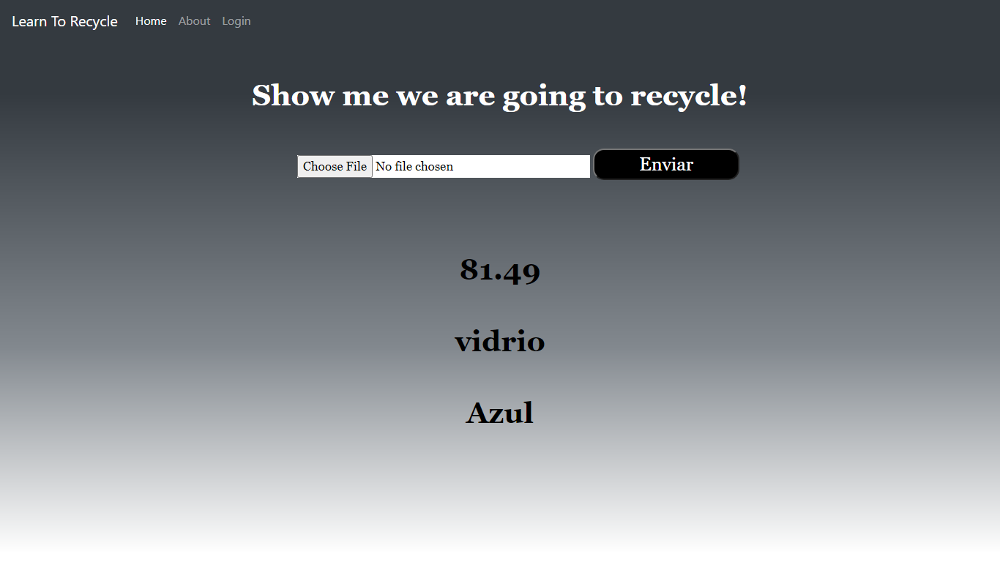

# LearnToRecycle

## Members
<<<<<<< HEAD
## Jhoan Sebastian Benavides Diaz
## Hairton Javier Sarmiento Yahuarcani
## David Santiago Restrepo Valencia
=======
## David Santiago Restrepo Valencia
## Hairton Javier Sarmiento Yahuarcani
## Jhoan Sebastian Benavides Diaz

>>>>>>> cce595f53baa503cb89f399408783c86a0c79e23

### Project Goal
## The goal of this project is to teach to the people to recycle, because in Bogotá the people don't know to recycle.

### About project
## We did a machine learning model, of which has the ability to predict different type of trash(paper, bottles, metal, glass, 
## cardboard and garbage), later we did a page in Flask framework where the user can create an account and to predict their trash.

 
 
 
 

 

 
